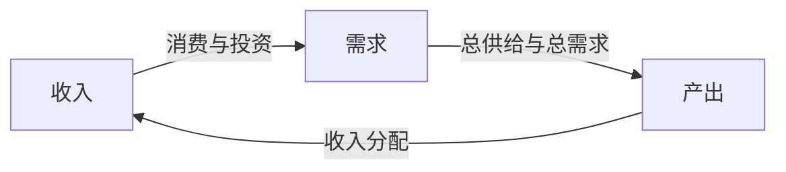

# 通过GDP认识中国经济

## 国民财富到GDP

### 国内生产总值(GDP)

国内生产总值：Gross Domestic Product

GDP的定义

指按市场价格计算的一个国家 (或地区)所有常住单位在一定时期内生产活动的最终成果。

将所有能够降低稀缺性的劳动成果加总，结果就是GDP

GDP is published on a quarterly basis as part of the National Income and Product Accounts (NIPA), two sources for which are [Bureau of Economic Analysis](http://www.bea.gov/national/index.htm#gdp) and [FRED database](https://research.stlouisfed.org/fred2/).

## 通过GDP认识中国经济

|统计方法||定义|计算方法|
|-|-|-|-|
|生产法|product approach|所有常住单位的增加值之和|第一、二、三产业的增加值(总产品-中间收入)之和|
|收入法|income approach|
|支出法|expenditure approach|

### 生产法

第一产业 产品直接取自自然界的生产部门

第二产业 对初级产品再加工的生产部门

第三产业 提供各种服务的部门

观察占比&波动

### 支出法

$$\begin{aligned}
{\rm 总支出 } & = {\rm 消费支出 + 投资支出 + (政府支出) + 净出口 } \\
\rm Y & = C + I + G + NX \\
\frac{\Delta Y}{Y} & = \frac{\Delta C}{C} + \frac{\Delta I}{I} + \frac{\Delta NX}{NX}
\end{aligned}$$

### 收入法

投入产出表中每10年公布4次

劳动者报酬占比变化

### 国民生产总值

国民生产总值(gross national product, GNP)

国外对国内净要素支付(net factor payments from abroad, NFP)

$$
\rm GNP = GDP + NFP
$$

### GDP的缺陷

GDP作为衡量总体经济福利时候(a mesure of aggregate economic welfare)

1. GDP不包含收入在人口中的分配方式
2. GDP遗漏了所有非市场活动，如家庭劳动、做饭

GDP作为衡量经济总产出的时候(a mesure of aggregate output)

1. **地下经济**(underground economy)不包含在GDP中
2. 如何计算政府支出，政府生产的大部分产品无法按照市场价格出售 (NIPA使用成本计算)

### 实际GDP和名义GDP

链式加权(chain-weighting)

### 价格水平的衡量指标

#### 隐含GDP价格缩减指数(implicit GDP price deflator)

$$\begin{aligned}
{\rm 隐含GDP价格缩减指数} & = {\rm \frac{名义GDP}{实际GDP} \times 100 }
\\\
\text{Implicit GDP price deflator} & = {\rm { Nominal \, GDP \over Real \, GDP } \times 100 }
\end{aligned}$$

#### 消费价格指数(consumer price index, CPI)

$$
{\rm 当年CPI = { 按当年价格计算的基年消费额 \over 按基年价格计算的基年消费额 } \times 100 }
$$

衡量通货膨胀率时，GDP价格缩减指数往往好于CPI。

#### 衡量实际GDP和价格水平的问题

1. 相对价格的不断变动。人们会根据相对价格的变化，调整消费的模式。进而使得在计量通货膨胀水平时，CPI相比隐含GDP价格缩减指数相对高估
2. NIPA未包含商品的质量变化
3. 衡量出的GDP中如何对待新商品

### Savings, Wealth and Capital

#### 私人可支配收入(private disposable income)

$$
Y^d = Y + NFP + TR + INT - T
$$

1. NFP 国外居民对本国居民的净要素支付
2. INT 政府债务的利息支出
3. T 税收

#### 私人部门储蓄(private sector saving)

$$\begin{aligned}
S^p & = Y^d - C \\
    & = Y + NFP + TR + INT - T - C \\
\end{aligned}$$

#### 政府储蓄(government saving)

政府盈余(government surplus): $S^g$

$$ S^g = T - TR - INT - G $$

政府赤字(government deficit): $D$

$$ D = -S^g = - T + TR + INT + G $$

#### 国民储蓄(national saving)

$$\begin{aligned}
S & = S^p + S^g \\
  & = Y + NFP - C - G \\
  & = C + I + G + NX + NFP - C - G \\
  & = I + NX + NFP \\
  & = I + CA
\end{aligned}$$

经常账户盈余(current account surplus) $NX + NFP$

上述等式反应“国内投资未吸收的国内储蓄一定会以商品或服务的形式输往国外

### Labor Market Measurement

1. employed
2. unemployed
3. not in the labor force

$$\begin{aligned}
\text{Unemployment rate} & = {\text{Number unemployed} \over \text{Labor force}} \\
\text{Participation rate} & = {\text{Labor force} \over \text{Total working=age populaction}} \\
\text{Employment/Population ratio} & = {\text{total Employment} \over \text{Total working=age population}}
\end{aligned}$$

#### 美国失业率实践

|方法||定义|
|-|-|-|
|U3|standard|
|U4|plus discouraged works|a working-age person who is neither employed nor unemployed, but is available to work, looked for work sometime during the previous 12 months, and has a job-market-related reason for not searching for work
|U5|plus marginally attached working-age persons|working-age persons who are neither employed nor unemployed, available to work, and looked for work sometime during the previous 12 months

## 初探中国经济的消费不足问题

## 中国宏观经济的数据质量问题

GDP增速与克强指数

GDP修正前后增速情况

中国 -> 香港 出口以及进口数字

