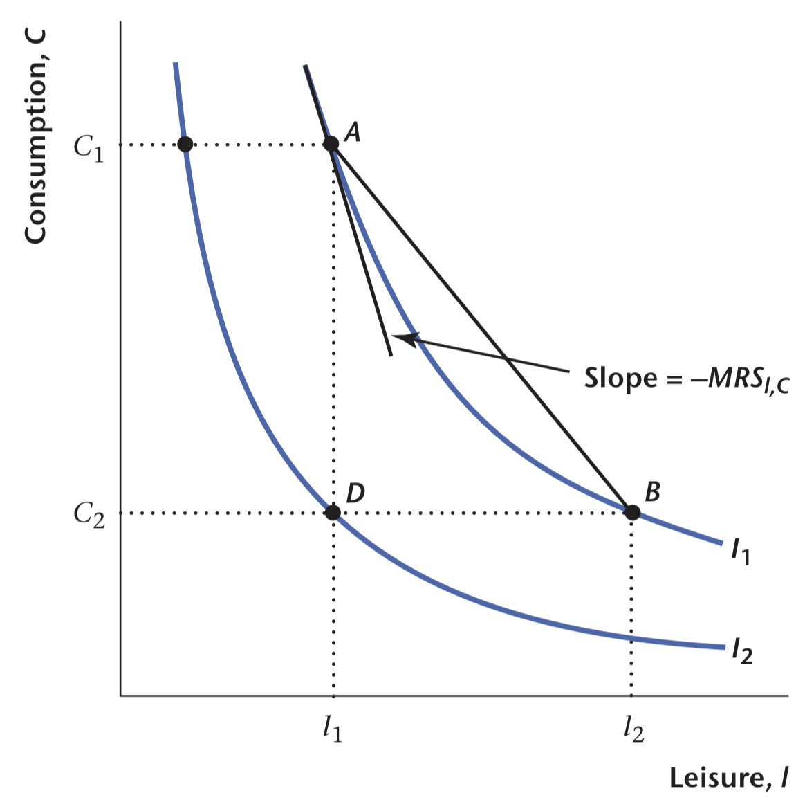

# Consumer and Firm Behavior: The Work-Leisure Decision and Profit Maximization

Given that there is only one time period, consumers and firms make static, as opposed to dynamic, decisions.

A fundamental principle that we adhere to here is that consumers and firms optimize(实现最优化).

## The Representative Consumer 典型消费者

We consider the behavior of a single representative consumer, who acts as a stand-in for all of the consumers in the economy.

Consumption good(an aggregation of all conumer goods) & leisure(any time spent not working)

**Utility function**(效用函数) to help we capture the preference of the representative consumer over leisure and consumption goods, written as $U(C,l)$.
$C$ is the quantity of consumption, $l$ is the quantity of leisure.
We refer to a particular combination of consumption and leisure—for example, $(C1, l1)$, where $C1$ is a particular consumption quantity and $l1$ is a particular quantity of leisure—as a **consumption bundle**(消费束).

Three properties of the perference of the representative consumer:

-   More is always preferred to less.
-   The consumer likes diversity in his consumption bundle.
-   Consumption and leisure are **normal goods**(正常品).
    -   **inferior good**(抵挡品)

### Indifference Curve

!!! info ""

    An **indiference curve** connects a set of points, with these points representing consumption bundles among which the consumer is indiferent.

An indifference curve has two key properties:

1.  An indifference curve slopes downward.
2.  An indifference curve is **convex**, that is bowed-in toward the origin.

{ width=500 }

!!! info ""

    The **marginal rate of substitution** of leisure for consumption, denoted $\text{MRS}_{l,C}$ is the rate at which the consumer is just willing to substitute leisure for consumption goods.

$$
\text{MRS}_{l,C} = -[\text{the slope of the indifference curve passing through (C,l)}]
$$

### Time Budget Constraint

!!! hint ""

    假设1 Assume that the representative consumer behaves competitively[^1].

[^1]: Competitive behavior means that the consumer is a price-taker; that is, he or she treats market prices as being given and acts as if his or her actions have no effect on those prices

!!! hint ""

    假设2 No money in this economy(barter economic)

$$\begin{align}
\text{Time Constraint:} \qquad\qquad\qquad\qquad l + N^s & = h & \tag 1 \\
闲暇时间 + 工作时间 & = 总可用时间(\text{total time available})
\end{align}$$

根据典型消费者的时间约束，可以得出实际可支配收入应为$\text{wage} + \text{dividend} - \text{taxes}$

one-period economy(一时期经济) <==> the consumer has no motive to save

$$\begin{align}
C & = wN^s & + & \pi &　- & T \\
{\rm 消费} & = \text{实际工资率} \times \text{工作时间} & + & \text{股息收入} & - & \text{一次总付税}
\end{align}$$

$$\begin{align}
C & = wN^s + \pi - T \\
C & = w(h-l) + \pi - T && \text{equation $(1)$} \\
C + wl & = wh + \pi - T && \text{move $wl$ to the left} & \tag 2 \\
C & = -wl + wh + \pi - T  \tag 3
\end{align}$$

In $(2)$，$C+wl$ is the implicit real expenditure on consumption goods and leisure. The total quantity of implicit real disposable income is $wh + \pi - T$.

In $(3)$, 

可以考虑加个图

### Consumer Optimization

!!! info ""

    假设3 Assume the consumer is **rational**.

!!! note ""

    The optimal consumption bundle(最优消费束) is the point representing a consumption–leisure pair that is on the highest possible indiference curve and is on or inside the consumer’s budget constraint.

### Income and Subsuitution Effects

